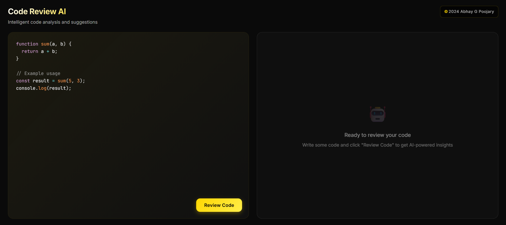

# AI-Powered Code Reviewer

This project is an AI-powered code review tool that allows developers to input code and receive detailed feedback on its quality, performance, and maintainability. It consists of a **frontend** built with React and Vite and a **backend** powered by Node.js and Express, integrated with Google's Gemini AI for code analysis.

## Live Demo
Frontend deployed here: [AI Code Reviewer](https://code-review-ai-omega.vercel.app/)

---

## Screenshot


---

## Features

- **Code Editor**: Write or paste your code directly into the editor.
- **AI-Powered Review**: Get detailed feedback on your code, including suggestions for improvement.
- **Syntax Highlighting**: Supports syntax highlighting for better readability.
- **Real-Time Updates**: Instant feedback rendered in Markdown format.

## Project Structure

```
AI-Powered-Code-Reviewer/
├── backend/
│   ├── .env                      # Environment variables
│   ├── package.json              # Backend dependencies and scripts
│   ├── server.js                 # Entry point for the backend
│   └── src/
│       ├── app.js                # Express app configuration
│       ├── controllers/          # API controllers
│       ├── routes/               # API routes
│       └── services/             # AI service integration
├── frontend/
│   ├── package.json              # Frontend dependencies and scripts
│   ├── vite.config.js            # Vite configuration
│   ├── public/                   # Static assets
│   └── src/
│       ├── App.jsx               # Main React component
│       ├── App.css               # Styling for the app
│       ├── main.jsx              # React entry point
│       └── assets/               # Additional assets
└── .gitignore                    # Files and directories to ignore in Git
```

## Installation

### Prerequisites

- Node.js (v16 or higher)
- npm or yarn

### Backend Setup

1. Navigate to the `backend` directory:
   ```bash
   cd backend
   ```

2. Install dependencies:
   ```bash
   npm install
   ```

3. Create a `.env` file and add your Google Gemini API key:
   ```env
   GEMINI_API_KEY=your_api_key_here
   ```

4. Start the backend server:
   ```bash
   node server.js
   ```

### Frontend Setup

1. Navigate to the `frontend` directory:
   ```bash
   cd ../frontend
   ```

2. Install dependencies:
   ```bash
   npm install
   ```

3. Start the development server:
   ```bash
   npm run dev
   ```

## Usage

1. Open the frontend in your browser (default: http://localhost:5173).
2. Enter your code in the editor on the left.
3. Click the **"Review"** button to get feedback from the AI.
4. View the AI's feedback in the panel on the right.

## Technologies Used

### Frontend

- React
- Vite
- Prism.js (for syntax highlighting)
- React Markdown (for rendering feedback)

### Backend

- Node.js
- Express
- Google Gemini AI (via `@google/generative-ai`)

## .gitignore

The following files and directories are ignored by Git:
```
node_modules/
.env
dist/
build/
```

## Contributing

Contributions are welcome! Please fork the repository and submit a pull request.

